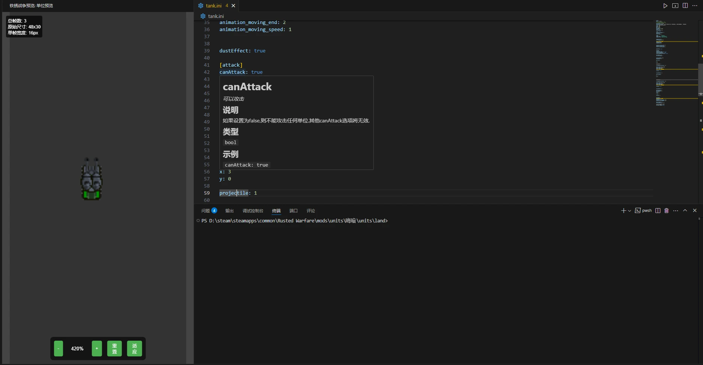

# RustedWarfareModSupport
正在开发的vscode插件,希望实现代码补全提示,可视化图片等..

已实现的功能:

1. 代码补全提示,悬停文档
2. 炮塔图片预览,但是本路径

## 引用与致谢

[铁锈战争wiki](https://rustedwarfare.org/)

- 查阅资料
- 遵守CC BY-SA 4.0协议

[RWini_Plugin](https://github.com/Blackburn507/RWini_Plugin)

- data数据与synataxes数据
- 遵守MIT协议

[lsp-sample](https://github.com/microsoft/vscode-extension-samples/tree/main/lsp-sample)

- 模板
- 遵守MIT协议

[github copilot](https://copilot.github.com/)
- 代码提示
- 修正补全

