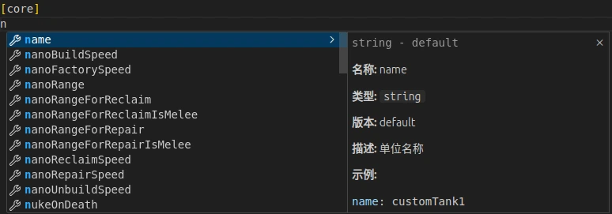
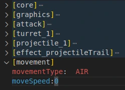
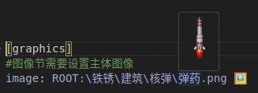
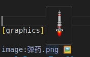
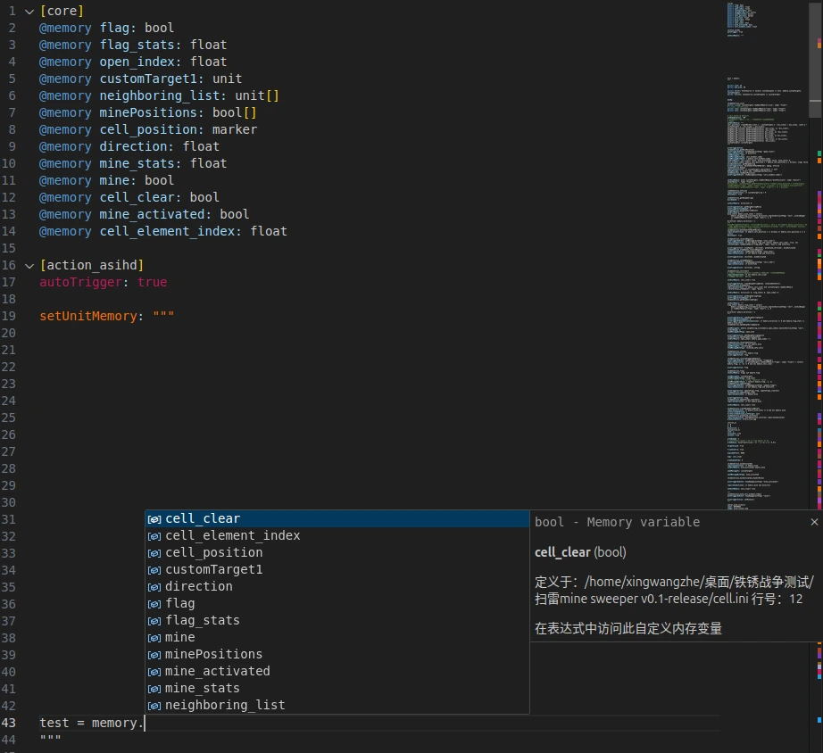

> 🤖 感谢 GitHub Copilot 在代码开发过程中提供的智能辅助和支持！
> 🤖 Thanks to GitHub Copilot for intelligent assistance and support during development!

> 欢迎给仓库点个 ⭐，您的支持是我们持续开发的动力！
> Welcome to star this repository ⭐, your support motivates us to keep improving!

# 支持多语言的 RustedWarfare Mod Support

欢迎在群聊交流 RustedWarfare 模组开发

QQ:GMBOX 的 mod 群: [1006360455](https://qm.qq.com/q/3ivoMQepwA)

> 📋 [更新日志 / Changelog](CHANGELOG.md) | 🐛 [报告问题 / Report Issues](https://github.com/xingwangzhe/RustedWarfareModSupport/issues)

- 多语言支持

- Multi-language support

正在开发的一个 RustedWarfare 模组开发工具，提供编辑器内的补全与文档提示功能。

A RustedWarfare mod development tool that provides in-editor completions and documentation hints.

## 已实现的功能

## Implemented features

### 节属性自动补全

### Section property completion

- 绝大部分节的属性键悬停信息提示（说明、示例、版本、弃用提示）

- Hover information for most section property keys (description, example, version, deprecation notes)

- 节折叠

- Section folding

### 属性值自动补全

### Property value completion

- 布尔值属性补全（true/false）

- Boolean property completion (true/false)

- 逻辑布尔表达式补全

- Logic boolean expression completion

- 单位生成属性补全（单位名建议）

- Unit spawn property completion (unit name suggestions)

- 图片预览

- Image preview

- 简单内存值补全上下文

- Simple memory value completion context

- 列表/枚举/特定类型的值补全（只完成了一些）

- List/enum/other type-specific value completion (only partially implemented)

### 其他功能

### Other features

- `mod-info.txt` 文件识别与补全

- File recognition and completion for `mod-info.txt`

- 感谢 copilot 的代码与翻译支持
- Thanks to copilot for code and translation support

### 侧边栏管理面板

### Panel Management

- 通过左侧边栏的面板来实现配置后缀，用户可以方便地添加、删除和管理自定义文件后缀。

- The panel now supports managing custom file extensions through the sidebar.

## 参考资料

## References

- NDT 代码表

- NDT code table

- Google 代码表

- Google code table

- [RWini_Plugin](https://github.com/Blackburn507/RWini_Plugin) 部分语法高亮

- [RWini_Plugin](https://github.com/Blackburn507/RWini_Plugin) partial syntax highlighting

您可以通过在 [GitHub](https://github.com/xingwangzhe/RustedWarfareModSupport) 上提交问题来改进本插件。

you can improve this plugin by submitting issues on [GitHub](https://github.com/xingwangzhe/RustedWarfareModSupport).

- INI代码高亮v0.99 娱乐部部长

- 部分枚举属性 GMBOX 

## 许可证

## License

本插件遵循 AGPL-3.0 协议（详见仓库 LICENSE.md）。

This extension is licensed under AGPL-3.0 (see LICENSE.md in the repository).
